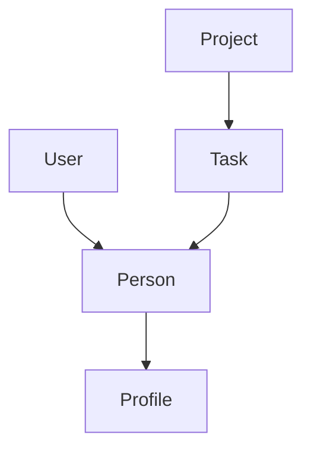

# API RESTful de Lista de Tarefas

Este projeto é uma API RESTful completa para gerenciamento de tarefas, implementando autenticação JWT, validação de dados e relacionamentos entre entidades usando MongoDB.

## Tecnologias Utilizadas

- Node.js
- Express.js
- MongoDB (Mongoose)
- JWT (JSON Web Token)
- Express Validator

## Estrutura do Projeto

```
├── controller/       # Controladores da API REST
├── database/         # Configuração do banco de dados
├── middleware/       # Middlewares de autenticação
├── model/           # Modelos do Mongoose
├── public/          # Arquivos estáticos
├── routes/          # Rotas da API REST
├── .env             # Variáveis de ambiente
├── index.js         # Arquivo principal
└── package.json     # Dependências
```

## Entidades e Funcionalidades

### Usuários (Users)
- Registro de novos usuários
- Login com autenticação JWT
- Gerenciamento de perfil
- Diferentes níveis de acesso (admin/user)

### Pessoas (Persons)
- Cadastro completo de pessoas
- Vinculação com tarefas e projetos
- Gerenciamento de informações pessoais
- Busca e filtros avançados

### Perfis (Profiles)
- Informações detalhadas das pessoas
- Preferências e configurações
- Histórico de atividades
- Personalização de dados

### Tarefas (Tasks)
- Criação e gerenciamento de tarefas
- Status de conclusão
- Priorização
- Atribuição a pessoas
- Categorização
- Prazos e lembretes
- Histórico de alterações

### Projetos (Projects)
- Organização de tarefas em projetos
- Múltiplos participantes
- Metas e objetivos
- Progresso e status
- Relatórios e métricas

## Endpoints da API

### Autenticação
- `POST /api/register` - Registrar novo usuário
  - Body: { username, email, password }
- `POST /api/login` - Login de usuário
  - Body: { email, password }
- `GET /api/profile` - Obter perfil do usuário autenticado
  - Header: Authorization Bearer Token

### Tarefas
- `GET /api/tasks` - Listar todas as tarefas
  - Query params: page, limit, status, priority
- `POST /api/tasks` - Criar nova tarefa
  - Body: { title, description, dueDate, priority, personId }
- `GET /api/tasks/:id` - Obter tarefa específica
- `PUT /api/tasks/:id` - Atualizar tarefa
  - Body: { title, description, status, priority }
- `DELETE /api/tasks/:id` - Excluir tarefa
- `GET /api/tasks/person/:personId` - Listar tarefas por pessoa
- `GET /api/tasks/project/:projectId` - Listar tarefas por projeto

### Pessoas
- `GET /api/persons` - Listar todas as pessoas
- `POST /api/persons` - Cadastrar nova pessoa
- `GET /api/persons/:id` - Obter pessoa específica
- `PUT /api/persons/:id` - Atualizar pessoa
- `DELETE /api/persons/:id` - Excluir pessoa
- `GET /api/persons/:id/tasks` - Listar tarefas da pessoa

### Perfis
- `GET /api/profiles` - Listar todos os perfis
- `POST /api/profiles` - Criar novo perfil
- `GET /api/profiles/:id` - Obter perfil específico
- `PUT /api/profiles/:id` - Atualizar perfil
- `DELETE /api/profiles/:id` - Excluir perfil

### Projetos
- `GET /api/projects` - Listar todos os projetos
- `POST /api/projects` - Criar novo projeto
- `GET /api/projects/:id` - Obter projeto específico
- `PUT /api/projects/:id` - Atualizar projeto
- `DELETE /api/projects/:id` - Excluir projeto
- `GET /api/projects/:id/tasks` - Listar tarefas do projeto
- `GET /api/projects/:id/persons` - Listar pessoas do projeto

## Recursos e Funcionalidades

### Paginação
Todos os endpoints de listagem suportam paginação através dos parâmetros:
- `page`: Número da página (default: 1)
- `limit`: Itens por página (default: 10)

### Filtros
Endpoints de listagem suportam filtros como:
- Status (pendente, em andamento, concluído)
- Prioridade (baixa, média, alta)
- Data (range de datas)
- Texto (busca em títulos e descrições)

### Ordenação
Suporte para ordenação por diferentes campos:
- Data de criação
- Prioridade
- Status
- Alfabética

### Segurança
- Autenticação JWT em rotas protegidas
- Validação de dados em todas as entradas
- Sanitização de inputs
- Proteção contra ataques comuns
- Níveis de acesso diferenciados
- Logs de atividades

## Instalação e Execução

1. Clone o repositório
2. Instale as dependências:
   ```
   npm install
   ```
3. Configure as variáveis de ambiente no arquivo `.env`:
   ```
   PORT=3000
   MONGODB_URI=sua_uri_mongodb
   JWT_SECRET=seu_secret_jwt
   ```
4. Inicie o servidor:
   ```
   npm run dev
   ```

## Boas Práticas Implementadas

- Validação robusta de dados
- Tratamento adequado de erros
- Respostas padronizadas
- Documentação clara e completa
- Código limpo e organizado
- Logs e monitoramento
- Segurança em primeiro lugar

## Licença

MIT 

## Guia Prático de Uso

### 1. Primeiros Passos - Autenticação

#### 1.1 Criar um Usuário (Register)
```http
POST /api/register
Content-Type: application/json

{
    "username": "admin_user",
    "email": "admin@example.com",
    "password": "senha123",
    "role": "admin"  // Pode ser "admin" ou "user"
}
```
- O campo `role` define o nível de acesso
- Admins podem acessar todas as rotas
- Users têm acesso limitado às suas próprias informações

#### 1.2 Login
```http
POST /api/login
Content-Type: application/json

{
    "email": "admin@example.com",
    "password": "senha123"
}
```
- Resposta incluirá um token JWT
- Guarde este token para usar nas próximas requisições
- Adicione no header: `Authorization: Bearer seu_token_jwt`

### 2. Fluxo de Criação de Entidades

#### 2.1 Criar uma Pessoa (Person)
- Primeiro, crie uma pessoa (obrigatório para criar perfil)
```http
POST /api/person
Authorization: Bearer seu_token_jwt
Content-Type: application/json

{
    "name": "João Silva",
    "age":15
}
```

#### 2.2 Criar um Perfil (Profile)
- Após criar a pessoa, crie seu perfil
```http
POST /api/profile
Authorization: Bearer seu_token_jwt
Content-Type: application/json

{
    "personId": "id_da_pessoa_criada",
    "occupation": "Desenvolvedor Full Stack",
    "phone": "(11) 99999-9999",
    "address": "Rua Exemplo, 123 - São Paulo, SP"
}
```

#### 2.3 Criar um Projeto
- Projetos podem ser criados independentemente
- Campos obrigatórios: `name` e `endDate`
- Campos opcionais: `description` e `startDate` (default: data atual)

```http
POST /api/projects
Authorization: Bearer seu_token_jwt
Content-Type: application/json

{
    "name": "Projeto Website",           // Obrigatório
    "description": "Desenvolvimento do novo website",  // Opcional
    "startDate": "2024-03-15",          // Opcional (default: data atual)
    "endDate": "2024-06-15"             // Obrigatório
}
```

Exemplo mínimo (apenas campos obrigatórios):
```json
{
    "name": "Projeto Website",
    "endDate": "2024-06-15"
}
```

#### 2.4 Adicionar Tarefa ao Projeto
- Após criar o projeto, adicione tarefas a ele
- Todos os campos são obrigatórios
```http
POST /api/projects/:projectId/tasks
Authorization: Bearer seu_token_jwt
Content-Type: application/json

{
    "title": "Implementar Login",         // Obrigatório
    "description": "Criar sistema de autenticação",  // Obrigatório
    "personId": "id_da_pessoa"            // Obrigatório
}
```

#### 2.5 Atualizar Status da Tarefa
- Marque uma tarefa como concluída
```http
PUT /api/projects/:projectId/tasks/:taskId
Authorization: Bearer seu_token_jwt
Content-Type: application/json

{
    "finished": true
}
```

#### 2.6 Remover Tarefa do Projeto
- Remova uma tarefa do projeto
```http
DELETE /api/projects/:projectId/tasks/:taskId
Authorization: Bearer seu_token_jwt
```

### 3. Relacionamentos e Dependências



- **User**: Independente (criar primeiro)
- **Person**: Independente (criar após user)
- **Profile**: Requer Person
- **Project**: Contém Tasks
- **Task**: Pertence a um Project e pode ter uma Person responsável

### 4. Buscas e Filtros

#### 4.1 Listar Projetos com suas Tarefas
```http
GET /api/projects
Authorization: Bearer seu_token_jwt
```

#### 4.2 Buscar Tarefas por Pessoa
```http
GET /api/projects?person=id_da_pessoa
Authorization: Bearer seu_token_jwt
```

### 5. Atualizações Comuns

#### 5.1 Atualizar Status de Tarefa
```http
PUT /api/projects/:projectId/tasks/:taskId
Authorization: Bearer seu_token_jwt
Content-Type: application/json

{
    "finished": true
}
```

#### 5.2 Atualizar Projeto
```http
PUT /api/projects/:projectId
Authorization: Bearer seu_token_jwt
Content-Type: application/json

{
    "name": "Novo Nome do Projeto",      // Obrigatório
    "description": "Nova descrição",      // Opcional
    "startDate": "2024-03-20",           // Opcional
    "endDate": "2024-07-20"              // Obrigatório
}
```

### 6. Códigos de Status HTTP

- 200: Sucesso
- 201: Criado com sucesso
- 400: Erro nos dados enviados
- 401: Não autorizado
- 403: Proibido (sem permissão)
- 404: Não encontrado
- 500: Erro interno

### 7. Dicas e Boas Práticas

1. **Ordem de Criação Recomendada**:
   - Criar usuário (register)
   - Fazer login (obter token)
   - Criar pessoa
   - Criar perfil
   - Criar projetos
   - Criar tarefas

2. **Validações Importantes**:
   - Emails devem ser únicos
   - Senhas devem ter mínimo 6 caracteres
   - Datas devem estar no formato ISO (YYYY-MM-DD)
   - IDs devem ser válidos do MongoDB

3. **Headers Necessários**:
   ```
   Authorization: Bearer seu_token_jwt
   Content-Type: application/json
   ```

4. **Ambiente de Desenvolvimento**:
   - Use Postman ou Insomnia para testar
   - Mantenha uma coleção organizada de requests
   - Crie variáveis de ambiente para tokens e URLs 